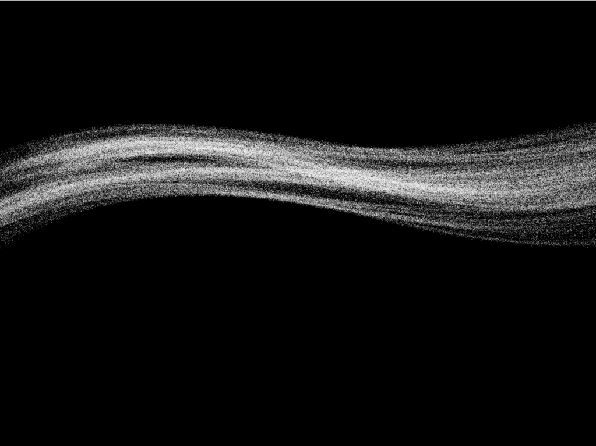

ofxSandLine
=====================================
ofxSandLine is a generative drawing tool based on [this article](http://inconvergent.net/grains-of-sand/) by Anders Hoff.

It might seem super simple but it's super easy to start generating images like this:

Installation
------------
Put the ofxSandLine folder into your addons folder.

Documentation
------------
The `example-simple-documentation` has all the different functions documented.

Compatibility
------------
Tested with 0.9.8 OSX. Should work with Windows and Linux too, if there are any issues, let me know!

Version history
------------
#### Version 0.2 (6 Feb 2018):
ofxSandTriangle support.

#### Version 0.1 (4 Jan 2018):
Initial release.
